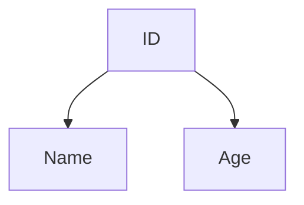

----

## What is Normalization
The process to assign entities to reduce or eliminate redundancies. In other word, reduce the likelihood of data anomalies.

It consist of 
- Assign new attributes based on concept of functional dependency and determination 

**Normalization** work through stage called **Normal Forms** 

### Normal Forms

The first three stage of Normal Forms are

1. 1NF (First Normal Form)
2. 2NF (Second Normal Form)
3. 3NF (Third Normal Form)

In the other hand, the highest normal form is not always desire. Sometimes, you need to do **Denormalization** to lower the Normal Form level too.

### What is Functional Dependency and Determination

Function Dependency (FD) is a relation between two attributes. It usually refer to primary key and some attributes those are non-key attributes.

