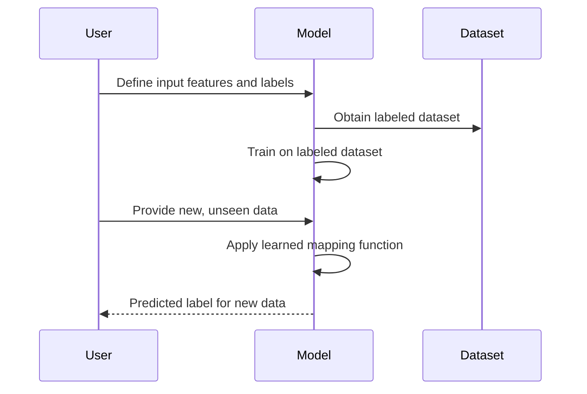

- [f] **Level:** #Intermediate
----

# Introduction to Supervised Learning

Technique that involves training a model using *labeled data* to make prediction or classify unseen data.

## 1. What is Supervised Learning?

Supervised learning is a type of machine learning where we have a dataset consisting of *input features* (also known as independent variables) and their *corresponding labels (also known as dependent variables or target variables)*. The goal is to learn a mapping function from the input features to the labels, enabling us to predict the label for new, unseen data.

## 2. Types of Supervised Learning Problems

Supervised learning can be categorized into two main types:

### 2.1. Classification
Classification problems involve *predicting* a discrete class or **category** for the given input. The labels in a classification problem are typically categorical variables. 
#### Example 
- email spam detection -
- sentiment analysis 
- image classification.

![[Supervised-Learning-1.png]]

### 2.2. Regression
Regression problems involve *predicting* a **continuous numerical value** as the output. The labels in a regression problem are typically continuous variables. 
#### Example 
- housing prices 
- stock market forecasting 
- estimating the sales volume based on historical data.

![[Supervised-Learning-2.png]]

## 3. Common Supervised Learning Algorithms

There are various algorithms used in supervised learning. Here are a few commonly used ones:

### 3.1. Decision Trees
Versatile and intuitive algorithms that create a tree-like model of decisions and their possible consequences. They partition the feature space into smaller regions and make predictions based on the majority class or mean value of the instances within each region.

### 3.2. Support Vector Machines (SVM)
Powerful algorithm used for both classification and regression tasks. It constructs a hyperplane or a set of hyperplanes that separates the input data into different classes or predicts continuous values based on maximizing the margin between the data points.

### 3.3. Naïve Bayes
Probabilistic classifier that applies Bayes' theorem with strong independence assumptions between features. It is fast, simple, and effective for text classification and spam filtering tasks.

### 3.4. Linear Regression
models the relationship between the input features and the target variable as a linear equation. It finds the best-fit line that minimizes the sum of squared differences between the observed and predicted values.

