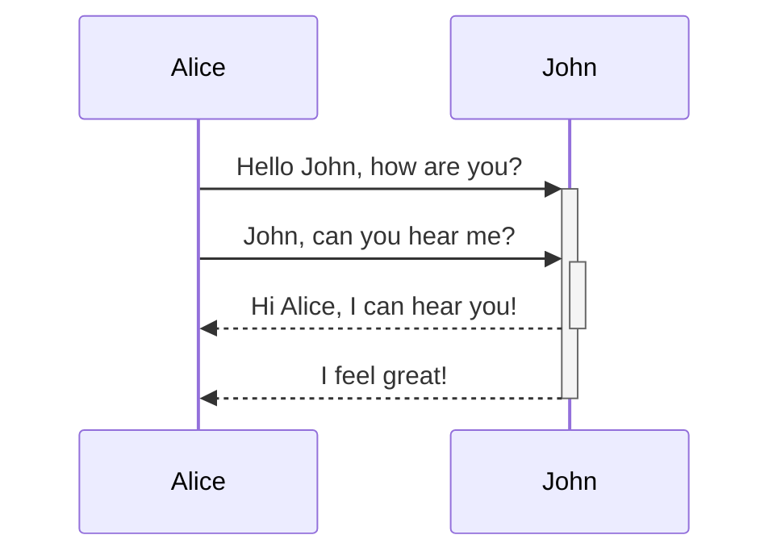

---

---
---

[Flowchart](http://mermaid.js.org/syntax/flowchart.html)
[Obsidian](https://help.obsidian.md/Editing+and+formatting/Obsidian+Flavored+Markdown)

---

> [!note]
> `>[!note]`
> Lorem ipsum dolor sit amet

> [!abstract]
> `>[!abstract,tldr,summary]`
> Lorem ipsum dolor sit amet

> [!info]
> `>[!info]`
> Lorem ipsum dolor sit amet

> [!todo]
> `>[!todo]`
> Lorem ipsum dolor sit amet

> [!tip]
> `>[!tip,hint,important]`
> Lorem ipsum dolor sit amet

> [!success]
> `>[!success,check,done]`
> Lorem ipsum dolor sit amet

> [!failure]
> `>[!failure,fail,missing]`
> Lorem ipsum dolor sit amet

> [!help]
> `>[!help,faq,question]`
> Lorem ipsum dolor sit amet

> [!warning]
> `>[!warning,caution,attention]`
> Lorem ipsum dolor sit amet

> [!danger]
> `> [!danger,error]`
> Lorem

> [!example]
> `>[!example]`
> Lorem ipsum dolor sit amet

> [!bug]
> `>[!bug]`
> Lorem ipsum dolor sit amet

> [!quote]
> `>[!quote,cite]`
> Lorem ipsum dolor sit amet

---

**Bold** 
*Italic*
~~Strike out text~~
==Highlight==

---

> Human beings face ever more complex and urgent problems, and their effectiveness in dealing with these problems is a matter that is critical to the stability and continued progress of society.

\- Doug Engelbart, 1961

---

Text inside `backticks` on a line will be formatted like code.

```
cd ~/Desktop
```

Tab or 4 blank spaces

	cd ~/Desktop
    cd ~/Desktop

```js
function fancyAlert(arg) {
  if(arg) {
    $.facebox({div:'#foo'})
  }
}
```

---

[Obsidian Help](https://help.obsidian.md)


```html
<iframe src="INSERT YOUR URL HERE"></iframe>
```


---

- [x] This is a completed task.
- [ ] This is an incomplete task.

---

This is a simple footnote[^1].

[^1]: This is the referenced text.
[^2]: Add 2 spaces at the start of each new line.
  This lets you write footnotes that span multiple lines.
[^note]: Named footnotes still appear as numbers, but can make it easier to identify and link references.

You can also use inline footnotes. ^[This is an inline footnote.]

---

this is an %%inline%% comment.

%%
This is a block comment.

Block comments can span multiple lines.
%%

---

| First name | Last name |
| ---------- | --------- |
| Max        | Planck    |
| Marie      | Curie     |

You can align text to the left, right, or center of a column by adding colons (`:`) to the header row.

Left-aligned text | Center-aligned text | Right-aligned text
:-- | :--: | --:
Content | Content | Content


---


$$
\begin{vmatrix}a & b\\
c & d
\end{vmatrix}=ad-bc
$$

---
